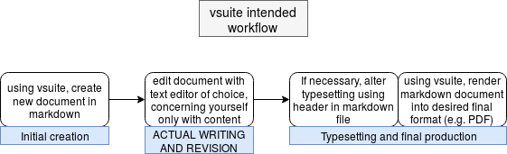

# vsuite

vsuite is a project management suite for Linux OSes aimed at writers who want
tools that help--rather than hinder--them in their writing. At its core, it is
a wrapper around various technologies that makes it easy to do your writing in
[markdown](https://rmarkdown.rstudio.com/lesson-8.html) files that can easily
be turned into finished final documents. Writing in markdown allows the writer,
once she is up-to-speed on its usage, to separate the conceptually-distinct
tasks of writing and typesetting in a manner largely inspired by
[this](http://ricardo.ecn.wfu.edu/~cottrell/wp.html)
[essay](https://web.archive.org/web/*/http://ricardo.ecn.wfu.edu/~cottrell/wp.html).
Take a look at the following workflow diagram, [this
demo](https://asciinema.org/a/162560), and the quick start guide below to see
if you might benefit from using this software.



You can find the full vsuite documentation
[here](http://vsuite.readthedocs.io).

**Note:** vsuite is considered to be in early alpha, and as such should not be
considered reliable yet. With that said, since it is a wrapper and never puts
itself in charge of deleting or overwriting any user data, the risk of using it
should be very minimal. Furthermore, it should go without saying that you
should always backup any data that matters.

## Installation

### Install required software

- pandoc (for rendering markdown to other formats)

- pandoc-citeproc (for citations in markdown)

- git (for optional versioning)

- make (for simplifying rendering of markdown)

- pip3 (for installing vsuite)

For Ubuntu 16.04:

```bash

sudo apt install pandoc pandoc-citeproc git make python3-pip

```

For Fedora 27:

```bash

sudo dnf install pandoc pandoc-citeproc git make python3-pip

```

### Install vsuite

Install vsuite as a Python package using pip3 pointed to this repo:

```bash

pip3 install --user git+<URL of this repo>

```

The program will place files in `~/.local/share/vsuite` and store its config in
`~/.config/vsuite`. The requisite files should be placed when the program is
run, but this has not yet been tested to any rigorous degree. Pip also creates
a vsuite executable named `vs` at `~/.local/bin/vs`, but if that location is
not not a part of your PATH, you will need to [manually add
it](http://linuxg.net/how-to-set-a-new-path-in-bash-ksh-and-zsh/).

## Quick Start

You might want to check out [this
demo](https://asciinema.org/a/0P06UgeiTM6EL4R8jbYdz7D7j) for an example of the
steps in this quick start. You can also find the full vsuite documentation
[here](http://vsuite.readthedocs.io).

### Initialize a project with `vs init`

vsuite uses the concept of a project directory, in which you have various
vsuite docs (which are simple pandoc markdown files) accompanied by a hidden
`.vsuite` directory that holds accompanying files like [CSL
files](https://en.wikipedia.org/wiki/Citation_Style_Language) and document
templates. To get started using it, you need to initialize a directory as
a vsuite directory:

```bash

vs init

```

This effectively creates an empty bibliography file, initializes a git
repository, and creates the `.vsuite` directory which includes a project config
file.

### Create a new markdown document with `vs new`

Finally, you can get started with actually creating markdown files using
vsuite:

```bash

vs new <document title>

```

This will create a file `<document title>.md`, after dropping or modifying
spaces or some special characters (since GNU make really struggles with these
things...). This file is generated from a template by vsuite and includes
a YAML header that specifies fields for pandoc. This file is the one that you
are meant to edit and do your work in. Tuning your text editor for use with
markdown will be greatly helpful in this, since the whole point of this writing
paradigm is to leave you, the writer, with more time doing actual writing. (For
example, see [this vim configuration
file](https://github.com/jessebl/installscripts/blob/master/configs/vim-writer/.writer.vimrc).)

### Render your document with `vs make`

When you're ready to turn your markdown source into files for use by others:


```bash

vs make <project name>.<file extension of desired format>

# E.g generate a PDF of your document file "best_document.md"

vs make best_document.pdf

```

This uses GNU make along with a makefile in `.vsuite` to freshly generate the
specified file unless it has been updated more recently than the source
markdown file. Hence, you can always make sure that you have up-to-date
documentation with `vs make`. The currently available formats are:

- pdf

- odt

- docx

# CSL licenses

The [CSL files](vsuite/project_files/csl) here are licensed with their
respective licenses by their respective copyright owners, noted within the
files themselves.

You can find many, many more citation styles in [this
repo](https://github.com/citation-style-language/styles) if vsuite does not
include one that you need or want. Just place them in `.vsuite/csl` for use
within a single project, or in `~/.local/share/vsuite/project_files/csl` for
general use (and consult the wiki on how to tune your settings for new
documents!).
