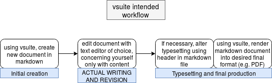

vsuite
======

vsuite is a project management suite for Linux OSes aimed at writers who want
tools that help--rather than hinder--them in their writing. At its core, it is
a wrapper around various technologies that makes it easy to do your writing in
`markdown <https://rmarkdown.rstudio.com/lesson-8.html>`_ files that can easily
be turned into finished final documents. Writing in markdown allows the writer,
once she is up-to-speed on its usage, to separate the conceptually-distinct
tasks of writing and typesetting in a manner largely inspired by `this
<http://ricardo.ecn.wfu.edu/~cottrell/wp.html>`_ `essay
<https://web.archive.org/web/*/http://ricardo.ecn.wfu.edu/~cottrell/wp.html>`_.
Take a look at the following workflow diagram and `this demo
<https://asciinema.org/a/162560>`_ to see if you might benefit from using this
software.

**Note:** vsuite is considered to be in early alpha, and as such should
not be considered reliable yet. With that said, since it is a wrapper
and never puts itself in charge of deleting or overwriting any user
data, the risk of using it should be very minimal. Furthermore, it
should go without saying that you should always backup any data that
matters.

.. toctree::
   :maxdepth: 2
   :caption: Contents:

   installation

   quickstart
